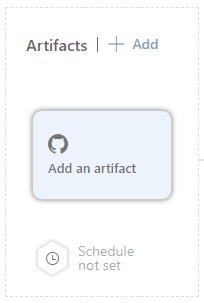
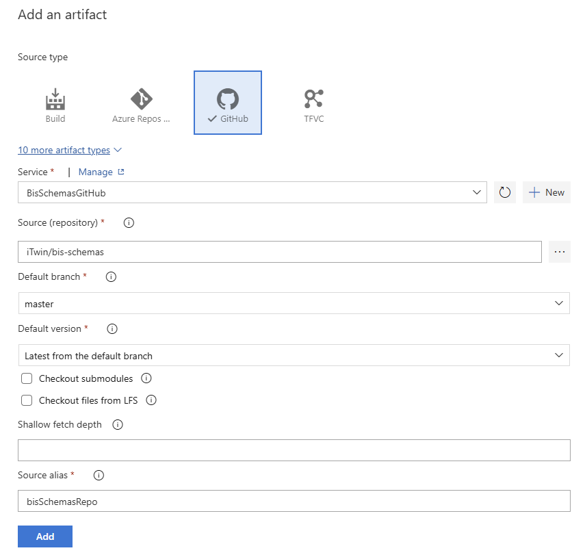

### Guidelines to Set Up the Tool in the Release Pipeline

1. Go to the release pipeline and edit it.
2. Add the [bis-schemas](https://github.com/iTwin/bis-schemas) repository artifact to this pipeline.

   

3. Configure the artifact settings as shown below:

   

4. Navigate to the stage where you want to perform the schema validation.
5. Add an agent job and name it '**BIS - Schema Tests**'.
6. Select the `windows-latest` agent from the Azure Pipelines pool for the execution of this job.
7. Add the '**BIS - Verify Installer Schemas**' task group and provide the required fields:
   1. **installerZipFilePath**: Path to the installer zip file.
   2. **bisRepoPath**: Path to the bis-schemas repository.
   3. **outputDir**: Path where output files will be generated.
8. Save the release pipeline and test the job.
